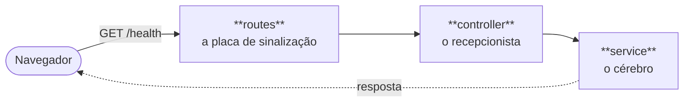

# 🚀 Aula 01: Criando Nossa Primeira API do Zero

Bem-vindos(as) ao mundo do desenvolvimento de software! Esta aula foi escrita pensando em
você, que nunca teve contato com programação antes. Vamos construir juntos uma **API**
passo a passo, desmistificando cada linha de código e cada comando. Pegue seu café ☕,
ajeite a postura e vamos lá!

---

## 🎯 O que você vai conseguir fazer ao final desta aula

- Explicar o que é uma API, um servidor e o protocolo HTTP usando suas próprias palavras.
- Criar um projeto Node.js com TypeScript do zero.
- Escrever uma rota que responde de verdade pela internet.
- Organizar o código em camadas com responsabilidades separadas.
- Compilar o projeto e rodá-lo como ele vai rodar no servidor de produção.

---

## 🛠️ Capítulo 0: Pré-requisitos (Preparando o Terreno)

Antes de colocarmos a mão na massa, precisamos garantir que as ferramentas básicas estão
prontas. Pense nisso como verificar se temos água e luz no terreno antes de construir a casa.

### 1. O Node.js e o npm

O Node.js é o motor que vai rodar o nosso código fora do navegador, e o npm é a nossa
"loja" de pacotes. Vamos verificar se já estão instalados.

Abra o terminal (Prompt de Comando ou PowerShell no Windows, Terminal no Mac/Linux) e digite:

```bash
node -v
```

Aperte `Enter`. Deve aparecer algo como `v24.2.0`.

Agora digite:

```bash
npm -v
```

Se aparecer um número, o npm também está lá.

> [!IMPORTANT]
> **Este projeto exige Node.js 24 ou superior.** Se a sua versão for menor, baixe a versão
> **LTS** em [https://nodejs.org](https://nodejs.org). A instalação é só avançar clicando
> em "Next" até o fim.
>
> Se o terminal disser "comando não reconhecido", é porque o Node não está instalado.

### 2. O Editor de Código (VS Code)

Você não vai escrever código no Bloco de Notas! Para programar usamos um "Editor de
Código", e o mais usado no mundo é o **Visual Studio Code**.

- Baixe gratuitamente em: [https://code.visualstudio.com/](https://code.visualstudio.com/)

### 3. Extensões do VS Code que vão te poupar horas

O VS Code puro já funciona, mas com algumas extensões ele vira outra coisa. Instale estas
quatro agora — cada uma resolve um problema real que você vai enfrentar hoje mesmo.

Para instalar: clique no ícone de **blocos** na barra lateral esquerda (ou `Ctrl + Shift + X`),
digite o nome, clique em **Install**.

| Extensão                                                     | O que ela faz por você                                                                                                                                                                                                                            |
| :----------------------------------------------------------- | :------------------------------------------------------------------------------------------------------------------------------------------------------------------------------------------------------------------------------------------------ |
| **Pretty TypeScript Errors**                                 | As mensagens de erro do TypeScript são famosas por serem quase impossíveis de ler quando você está começando. Esta extensão reescreve o erro em um formato colorido e organizado. Provavelmente é a que mais vai te ajudar nas primeiras semanas. |
| **Error Lens**                                               | Mostra o erro **na própria linha**, em vermelho, do lado do código. Sem ela, você precisa passar o mouse por cima ou abrir um painel separado para descobrir o que está errado.                                                                   |
| **REST Client**                                              | Permite testar as rotas da API de dentro do editor, sem instalar outro programa. Usaremos no Capítulo 5.                                                                                                                                          |
| **Code Spell Checker** + **dicionário Português Brasileiro** | Sublinha palavras escritas errado, tanto em nomes de variáveis quanto nos comentários em português. Um nome digitado errado vira um bug difícil de encontrar.                                                                                     |

> [!TIP]
> Na Aula 03 nós vamos registrar essa lista de extensões em um arquivo chamado
> `.vscode/extensions.json`, versionado junto com o código. A partir daí, quem clonar o
> projeto recebe a sugestão das extensões certas sozinho — ninguém precisa lembrar de avisar
> o colega novo. Por enquanto, instale-as na mão.

### 4. Abrindo o Terminal Integrado

O VS Code tem um terminal embutido, para não precisarmos alternar entre janelas.

1. Na barra superior, clique em "Terminal" → "New Terminal".
2. **Atalho:** pressione `Ctrl` junto com a crase `` ` ``. Isso abre e fecha o terminal na
   parte de baixo da tela.

Pronto! Agora estamos 100% preparados.

---

## 📖 Capítulo 1: O que vamos construir?

Antes de digitar códigos estranhos no teclado, precisamos entender o que estamos
construindo: uma **API REST**. Mas o que é isso?

### 🍽️ O que é uma API?

Imagine que você foi a um restaurante. Você é o **cliente** (pode ser um aplicativo de
celular, um site, ou você no navegador). Na cozinha estão os cozinheiros e os ingredientes
(o nosso **banco de dados** e a nossa **lógica**).

Mas você não pode entrar na cozinha e pegar a comida, certo? Você precisa de alguém para
anotar o seu pedido, levar até a cozinha e trazer o prato pronto. Esse alguém é o **garçom**.

Na programação, a **API** (_Application Programming Interface_) é o nosso garçom. Ela recebe
pedidos (requisições), leva até o sistema, processa e devolve uma resposta.

### 📋 O que é REST?

No restaurante, o garçom não aceita pedidos de qualquer jeito. Você não pode pedir "uma
coisa amarela com gosto bom". Você escolhe algo do **cardápio**.

O **REST** é o nosso padrão de cardápio: um conjunto de convenções que diz como a API deve
se comportar. Se a API segue essas convenções, dizemos que ela é "RESTful". Na prática, isso
significa que qualquer aplicativo consegue adivinhar como conversar com ela.

### 💻 O que é um Servidor?

Um servidor é simplesmente um computador, como o seu. A diferença é que ele fica ligado 24
horas por dia com um programa rodando sem parar, "escutando" e aguardando alguém fazer um
pedido. Quando você acessa `google.com`, seu computador manda um pedido para um servidor do
Google, que devolve a página.

### 📬 O que é HTTP e seus métodos?

O **HTTP** é o "idioma" que cliente e servidor usam para conversar. É o formato oficial do
bilhete que o garçom anota.

Nesse idioma existem intenções diferentes, chamadas de **métodos**:

- **GET (pegar)** — pedir uma informação. _"Garçom, me traga o cardápio."_
- **POST (criar)** — mandar uma informação nova para ser salva. _"Anote este pedido: uma pizza."_
- **PUT (atualizar)** — substituir uma informação existente. _"Troque a calabresa por frango."_
- **DELETE (apagar)** — remover uma informação. _"Cancele a minha pizza."_

Toda resposta também traz um **código de status**, um número que resume o que aconteceu:
`200` deu certo, `404` não encontrado, `500` erro do servidor.

---

## 🛠️ Capítulo 2: Ferramentas que vamos usar

Assim como um carpinteiro precisa de martelo, pregos e serrote, nós precisamos de algumas
ferramentas.

### 🟢 Node.js

O **JavaScript** só funcionava dentro do navegador, para fazer botões brilharem e menus
abrirem. O **Node.js** é um motor que pegou o JavaScript, tirou de dentro do navegador e
permitiu que ele rodasse direto no computador, do lado do servidor. É a base de tudo.

### 📦 npm (Node Package Manager)

Pense no **npm** como a loja de aplicativos do programador. Se você precisa de uma roda,
não precisa inventar a roda: vai na loja e pega uma pronta. O npm é um catálogo gigante onde
programadores do mundo todo publicam "pacotes" de código prontos, de graça.

### 🛡️ TypeScript

O JavaScript puro é muito flexível, e isso é perigoso. É como construir um prédio de
chinelo e sem capacete.

O **TypeScript** é um "JavaScript com equipamento de segurança". Ele adiciona **tipos**: se
você tentar colocar uma palavra onde deveria ir um número, ele avisa **enquanto você digita**,
antes do programa rodar. O erro nunca chega no cidadão.

### ⚡ Fastify

Lembra que a API é o garçom? O **Fastify** é um garçom de elite, rápido e eficiente. Ele é
um _framework_: uma estrutura pronta que resolve, em duas ou três linhas, o que levaria
centenas de linhas para escrever à mão.

Escolhemos o Fastify por três motivos: é um dos mais rápidos do ecossistema Node, já vem com
um sistema de registro de eventos (logger) embutido, e sabe validar dados sozinho a partir
de uma descrição — coisas que vamos usar nas próximas aulas.

### 🔄 tsx

O Node.js só entende JavaScript. Ele não entende TypeScript. Para rodar nosso código
precisamos "traduzir" (compilar) de um para o outro. O **tsx** faz essa tradução em
milissegundos enquanto desenvolvemos, para não perdermos tempo esperando.

---

## 🏗️ Capítulo 3: Criando o projeto do zero

Agora vamos sujar as mãos, usando o terminal integrado do VS Code.

### Passo 1: Criando a pasta e inicializando o projeto

Antes de digitar qualquer coisa, decida **onde** o projeto vai morar. O terminal cria a pasta
no lugar em que ele estiver apontando no momento — e um VS Code recém-instalado, sem nenhuma
pasta aberta, aponta para a sua pasta pessoal de usuário. Escolha uma pasta sua para guardar
projetos (por exemplo `Documentos\projetos`) e entre nela primeiro:

```bash
cd Documentos\projetos
```

A primeira linha do terminal mostra o caminho atual. Confira que ele é o que você quer antes
de seguir.

Agora digite os comandos um por um, apertando `Enter` após cada um:

```bash
mkdir curso_api
cd curso_api
npm init -y
```

**O que aconteceu aqui?**

- `mkdir` (_make directory_) cria uma pasta com o nome indicado.
- `cd` (_change directory_) manda o terminal **entrar** nessa pasta. Tudo daqui pra frente
  acontece lá dentro.
- `npm init -y` diz ao npm: "inicie um projeto aqui". O `-y` responde "sim" para todas as
  perguntas padrão.

Isso cria o arquivo `package.json`, que é a identidade do projeto:

```json
{
  "name": "curso_api",
  "version": "1.0.0",
  "description": "",
  "main": "index.js",
  "scripts": {
    "test": "echo \"Error: no test specified\" && exit 1"
  },
  "keywords": [],
  "author": "",
  "license": "ISC",
  "type": "commonjs"
}
```

- `"name"` — o nome do projeto.
- `"version"` — a versão atual.
- `"main"` — qual arquivo dá a partida.
- `"scripts"` — atalhos de comando (vamos mudar isso já já).
- `"type"` — o sistema de módulos do projeto. O npm 11 grava `"commonjs"` sozinho, que é o
  formato antigo. No Passo 4 nós vamos trocar por `"module"`, que é o formato moderno. Se a
  sua versão do npm for mais antiga e essa linha não aparecer, não tem problema: o Passo 4
  reescreve o arquivo inteiro de qualquer jeito.

### Passo 1.5: Abrindo o projeto no VS Code

A pasta existe, mas o VS Code ainda não sabe disso. Com o terminal já dentro dela, digite:

```bash
code .
```

O ponto significa "esta pasta aqui". Uma nova janela do VS Code abre já com o projeto no
painel da esquerda. É nesse painel que você vai criar os arquivos dos próximos passos.

(Se o comando `code` não for reconhecido, use o menu **Arquivo → Abrir Pasta** e escolha a
pasta `curso_api`.)

### Passo 2: Instalando os pacotes

Vamos à loja buscar as peças. Primeiro o Fastify:

```bash
npm install fastify
```

> [!NOTE]
> O `npm install` baixa os pacotes da internet, coloca em uma pasta enorme chamada
> `node_modules` (na qual você nunca deve mexer) e anota no `package.json`, na seção
> `dependencies`. São coisas que o programa **precisa** para funcionar quando estiver no ar.

Agora as ferramentas de desenvolvimento:

```bash
npm install -D typescript@6 @types/node tsx
```

> [!TIP]
> O `-D` maiúsculo significa _Development_. Isso coloca os pacotes em `devDependencies`: são
> ferramentas que **nós** usamos para construir (como martelo e furadeira), mas que o cliente
> não precisa levar para casa junto com o móvel pronto.

O que compramos?

- **typescript** — o compilador que adiciona nossas regras de segurança.
- **@types/node** — um "dicionário" que ensina ao TypeScript as palavras próprias do Node.js,
  como `process`. Sem ele, o TypeScript não sabe que elas existem.
- **tsx** — nosso tradutor simultâneo, para rodar o projeto enquanto programamos.

> [!IMPORTANT]
> **Por que `typescript@6` e não a versão mais nova?**
>
> Repare que fixamos a versão 6 de propósito. Na Aula 03 vamos instalar uma ferramenta de
> qualidade chamada ESLint, e ela ainda não funciona com a versão 7 do TypeScript.
>
> Isso não é um detalhe chato: é o dia a dia real da profissão. As ferramentas do ecossistema
> evoluem em ritmos diferentes, e faz parte do trabalho escolher a combinação que funciona
> junto. Você mesmo vai conseguir conferir isso na Aula 03, com um comando.

### Passo 3: Configurando o TypeScript

O TypeScript precisa de um manual de regras. Crie um arquivo chamado `tsconfig.json` na raiz
do projeto (na mesma pasta do `package.json`) e cole isto **completo**:

```json
{
  "compilerOptions": {
    "target": "ES2022",
    "module": "Node16",
    "moduleResolution": "Node16",
    "lib": ["ES2022"],
    "types": ["node"],

    "outDir": "./dist",
    "rootDir": "./src",

    "allowImportingTsExtensions": true,
    "rewriteRelativeImportExtensions": true,
    "verbatimModuleSyntax": true,

    "strict": true,
    "noUncheckedIndexedAccess": true,
    "noImplicitOverride": true,
    "noFallthroughCasesInSwitch": true,
    "noUnusedLocals": true,
    "noUnusedParameters": true,

    "esModuleInterop": true,
    "skipLibCheck": true,
    "forceConsistentCasingInFileNames": true,
    "resolveJsonModule": true,
    "sourceMap": true
  },
  "include": ["src"],
  "exclude": ["node_modules", "dist"]
}
```

Calma, não se assuste. Vamos por grupos.

**Onde entra e onde sai o código:**

- `"rootDir": "./src"` — "meus arquivos originais ficam na pasta `src`" (de _source_, fonte).
- `"outDir": "./dist"` — "coloque o código traduzido na pasta `dist`" (de _distribution_).

**Como escrevemos os imports** — este grupo é o mais importante desta aula:

- `"allowImportingTsExtensions"` e `"rewriteRelativeImportExtensions"` — juntos, permitem que
  você escreva `import { algo } from './arquivo.ts'` no código-fonte. Na hora de compilar, o
  TypeScript troca sozinho para `./arquivo.js` lá no `dist`.

  **Traduzindo:** você escreve TypeScript o tempo todo e **nunca digita `.js` na sua vida**.
  O compilador cuida disso.

- `"verbatimModuleSyntax"` — obriga a deixar explícito quando um import serve só para tipagem.
  Você vai ver `import type` aparecendo daqui a pouco, e vamos explicar exatamente por quê.

**As regras de segurança:**

- `"strict": true` — liga o modo máximo de segurança. Ele reclama de qualquer coisa que possa
  virar erro depois. É a nossa garantia de qualidade.
- `"noUnusedLocals"` e `"noUnusedParameters"` — reclamam de variável criada e nunca usada.
  Quase sempre isso é código esquecido ou erro de digitação.
- `"types": ["node"]` — diz ao TypeScript para carregar aquele dicionário do Node que
  instalamos. Sem esta linha, ele não reconhece `process`.
- `"sourceMap": true` — gera, ao lado de cada `.js`, um arquivo `.js.map`. É um mapa que liga
  o código compilado de volta à linha original em TypeScript, para que uma mensagem de erro em
  produção aponte para o seu `.ts` e não para o `.js` traduzido.

### Passo 4: Configurando o package.json

Abra o `package.json` e deixe assim. **Copie tudo ao pé da letra, com uma única exceção: as
quatro linhas de versão em `dependencies` e `devDependencies` — nessas, mantenha os números
que já estão no seu arquivo**, porque foi isso que o npm instalou de fato.

```json
{
  "name": "curso_api",
  "version": "1.0.0",
  "description": "API RESTful backend do sistema API do Curso",
  "main": "dist/server.js",
  "type": "module",
  "engines": {
    "node": ">=22"
  },
  "scripts": {
    "dev": "tsx watch src/server.ts",
    "prebuild": "node --eval \"require('node:fs').rmSync('dist', { recursive: true, force: true })\"",
    "build": "tsc",
    "start": "node dist/server.js"
  },
  "keywords": [],
  "author": "",
  "license": "ISC",
  "dependencies": {
    "fastify": "^5.12.0"
  },
  "devDependencies": {
    "@types/node": "^26.2.0",
    "tsx": "^4.23.12",
    "typescript": "^6.0.3"
  }
}
```

**As duas linhas novas que merecem atenção:**

- `"type": "module"` — diz ao Node que este projeto usa o sistema **moderno** de módulos, com
  `import` e `export`. É o padrão do ecossistema hoje.
- `"engines"` — registra que o projeto exige Node 22 ou superior. Serve de aviso para quem
  for instalar em um servidor com versão antiga, evitando uma quebra misteriosa em produção.

**E os scripts:**

- `npm run dev` — roda `tsx watch`. O `watch` (vigiar) fica de olho nos arquivos: você salva,
  ele reinicia o servidor sozinho. É o que usamos o dia inteiro.
- `npm run build` — roda o compilador, que confere todas as regras de segurança e gera o
  JavaScript final em `dist`.
- `npm run prebuild` — você **não** chama este. O npm executa qualquer script chamado
  `pre<alguma-coisa>` automaticamente antes do script de mesmo nome. Ele apaga a pasta `dist`
  antes de cada compilação, para que um arquivo que você excluiu do `src` não continue vivo
  no `dist`, assombrando o projeto.
- `npm start` — executa o código pronto usando só o Node, sem nenhuma ferramenta de
  desenvolvimento. **É exatamente assim que a API vai rodar no servidor do órgão.**

### O `.nvmrc`: a mesma versão do Node para todo mundo

O `"engines"` que você acabou de escrever é um **aviso**: ele diz "este projeto precisa de Node
22 ou mais novo". Serve para quem for instalar a API em um servidor perceber que a versão de lá
não serve.

Só que aviso não instala nada. Ele não faz o seu computador **usar** a versão certa — só
reclama depois que já deu errado.

Falta a outra metade: um arquivo que diga qual versão exata este projeto usa, para que todo
mundo da equipe trabalhe na mesma. Esse arquivo se chama `.nvmrc`.

Crie um arquivo chamado `.nvmrc` na **raiz do projeto** (na mesma altura do `package.json`), com
uma única linha.

Rode `node -v` e copie **a saída exata**, com o `v` na frente, para dentro do arquivo. No
computador em que esta aula foi escrita a saída foi `v24.2.0`, então o arquivo ficou assim:

```
v24.2.0
```

Se a sua saída for outra (por exemplo `v24.9.0`), escreva a sua — o arquivo tem que descrever a
sua máquina, não a nossa.

> [!NOTE]
> Repare no ponto no começo do nome. Assim como o `.gitignore` que você vai criar na Aula 02,
> arquivos que começam com ponto são **arquivos de configuração**. O VS Code mostra todos eles
> normalmente; alguns sistemas os escondem no explorador de arquivos.

**Por que dois arquivos para a "mesma" informação?**

Eles respondem a perguntas diferentes:

| Arquivo   | Pergunta que responde                       | Quem lê                                   |
| :-------- | :------------------------------------------ | :---------------------------------------- |
| `engines` | Qual é a versão **mínima** aceitável?       | O npm, na hora de instalar em um servidor |
| `.nvmrc`  | Qual é a versão **exata** que a equipe usa? | Gerenciadores de versão do Node, e você   |

`>=22` é uma faixa larga de propósito: a API funciona em qualquer Node dessa faixa, e travar o
servidor do órgão em um número exato só criaria dor de cabeça na hora de atualizar.

Já entre nós, na hora de programar, faixa larga é problema. Se você roda Node 22 e o seu colega
roda Node 24, vocês dois estão "dentro do permitido" — e mesmo assim um bug pode aparecer só na
máquina de um. O `.nvmrc` elimina essa diferença.

> [!TIP]
> Se você usa um gerenciador de versões do Node (o `nvm`, o `fnm` ou o `volta`), basta rodar
> `nvm use` dentro da pasta do projeto: ele lê o `.nvmrc` e troca de versão sozinho. Se você
> instalou o Node direto pelo site, como fizemos no Capítulo 1, o arquivo funciona como
> documentação da versão que você está usando de fato.

O valor deste arquivo é ser a **fonte única** da versão do Node. Qualquer pessoa que clone o
projeto — ou qualquer ferramenta que precise saber em que versão ele roda — lê o `.nvmrc`, em
vez de ter o número escrito em outro lugar. Assim, no dia em que o projeto subir de versão,
muda-se um arquivo só.

---

## 💻 Capítulo 4: Escrevendo o código

Agora começa a mágica. Vamos organizar o código usando um padrão chamado **Feature-First**
(funcionalidade primeiro).

Em vez de criarmos uma pasta "Controladores" e jogarmos lá dentro os controladores do sistema
inteiro — como uma cômoda com "gaveta de mangas", "gaveta de botões" e "gaveta de zíperes" —
nós agrupamos por funcionalidade: **a gaveta da camisa inteira, pronta**.

Nossa primeira funcionalidade é o **Health Check** (checagem de saúde): uma rota simples que
responde "estou vivo e bem", para sabermos que o servidor não travou.

### Passo 5: Criando a estrutura de pastas

Crie exatamente esta estrutura (botão direito → "Nova Pasta" / "Novo Arquivo" no VS Code):

```
src/
├── server.ts
├── app.ts
└── modules/
    └── health/
        ├── health.routes.ts
        ├── health.controller.ts
        └── health.service.ts
```

E é assim que uma requisição vai atravessar esses arquivos:



### Passo 6: Criando o Service (o cérebro 🧠)

O **Service** é onde mora a regra de negócio. É a parte inteligente do programa: faz
cálculos, busca dados e sabe das coisas.

Abra `src/modules/health/health.service.ts` e cole este código **completo**:

```typescript
/**
 * HealthService
 *
 * Concentra a lógica de negócio da funcionalidade de Health Check (checagem de
 * saúde). É ele quem sabe COMO montar a resposta; o controller apenas pede.
 *
 * Separar a lógica (aqui) da camada HTTP (controller) é o que nos permite testar
 * esta classe sem simular uma requisição da internet.
 */

/**
 * Formato da resposta do health check.
 */
export interface HealthStatus {
  status: string
  uptime: number
  timestamp: string
  environment: string
}

export class HealthService {
  /**
   * Coleta o estado atual da aplicação.
   *
   * @returns Objeto com o status, há quanto tempo a API está no ar e em qual
   *          ambiente ela está rodando.
   */
  getStatus(): HealthStatus {
    return {
      status: 'ok',

      // `process.uptime()` devolve há quantos segundos este processo está no ar.
      // Ferramentas de monitoramento usam esse número para detectar quando a API
      // está reiniciando sozinha em looping.
      uptime: process.uptime(),

      timestamp: new Date().toISOString(),

      // Saber em qual ambiente a resposta foi gerada evita a confusão clássica de
      // investigar um problema em produção olhando para a instância de homologação.
      environment: process.env.NODE_ENV ?? 'development',
    }
  }
}
```

**Explicando as partes principais:**

1. `export interface HealthStatus` — `interface` cria um **contrato** do TypeScript. Estamos
   dizendo: "a resposta de saúde tem obrigatoriamente um `status` que é texto, um `uptime`
   que é número, e assim por diante". Se amanhã alguém tentar devolver `status: 123`, o
   TypeScript bloqueia. É o capacete funcionando.
2. `export class HealthService` — uma `class` é uma fôrma, uma fábrica que produz nossa
   lógica. O `export` avisa que outros arquivos podem importá-la.
3. `getStatus(): HealthStatus` — criamos uma ação (chamada de _método_). O `: HealthStatus`
   garante que a resposta vai cumprir exatamente aquele contrato.
4. `process.uptime()` — o Node tem um objeto global chamado `process`. O `uptime()` é um
   cronômetro que diz há quantos segundos o servidor está de pé sem cair.
5. `new Date().toISOString()` — `new Date()` pega o relógio de agora; `.toISOString()`
   formata a data em um padrão universal que todos os sistemas entendem.
6. `process.env.NODE_ENV ?? 'development'` — `process.env` lê as **variáveis de ambiente** do
   computador. O operador `??` diz: "tente ler `NODE_ENV`; **se não existir**, use
   `'development'`".

> [!NOTE]
> Ler `process.env` direto assim funciona, mas não é o ideal. Se alguém digitar a
> configuração errada, o programa aceita em silêncio e você só descobre quando algo quebra.
> **Na Aula 04 vamos consertar isso** com uma validação que derruba a API logo na partida,
> com uma mensagem clara. Ficou registrado.

### Passo 7: Criando o Controller (o recepcionista 🤵)

Se o Service é o cérebro escondido que sabe as coisas, o **Controller** é o recepcionista
elegante no balcão. Ele não sabe cozinhar: o trabalho dele é pegar o pedido que chegou da
internet e chamar quem sabe fazer.

Abra `src/modules/health/health.controller.ts`:

```typescript
/**
 * HealthController
 *
 * Recebe a requisição HTTP, pede o trabalho ao service e devolve a resposta.
 *
 * Regra de ouro do projeto: o controller NUNCA contém lógica de negócio.
 * Nada de cálculo, nada de `if` de regra. Ele só faz três coisas:
 *   1. Recebe a requisição
 *   2. Chama o service
 *   3. Devolve a resposta
 */

import type { FastifyReply, FastifyRequest } from 'fastify'
import type { HealthService } from './health.service.ts'

export class HealthController {
  /**
   * Recebe o service pronto, por parâmetro do construtor, em vez de criá-lo aqui
   * dentro. Isso se chama injeção de dependência e é o que nos permitirá, nos
   * testes, entregar um service falso para verificar o controller isoladamente.
   */
  constructor(private readonly healthService: HealthService) {}

  /**
   * Responde à requisição `GET /health`.
   *
   * @param _request Requisição recebida. O prefixo `_` marca que não a usamos
   *                 nesta rota — ela não recebe parâmetro nenhum.
   * @param reply    Objeto usado para devolver a resposta ao cliente.
   */
  async handle(_request: FastifyRequest, reply: FastifyReply): Promise<FastifyReply> {
    const status = this.healthService.getStatus()

    // Declaramos o 200 explicitamente. O Fastify assumiria 200 sozinho, mas
    // deixar escrito torna a intenção óbvia para quem ler o código depois.
    return reply.status(200).send(status)
  }
}
```

**Três coisas novas aqui, e todas importantes:**

**1. `import type` em vez de `import`**

Repare que escrevemos `import type { FastifyReply, ... }`. Isso avisa: "eu só quero o
**contrato**, não o código de verdade".

Por que isso importa? Tipos existem apenas enquanto você programa — eles somem completamente
quando o código é compilado. Ao escrever `import type`, o TypeScript apaga a linha inteira na
tradução, e o programa final fica menor e mais rápido. Foi a opção `verbatimModuleSyntax`, no
`tsconfig.json`, que nos obrigou a ser explícitos.

**2. O `_` antes de `_request`**

Nossa função recebe `request` e `reply`, mas nesta rota não usamos o `request` (ninguém manda
dado nenhum para `/health`). Como ligamos a regra `noUnusedParameters`, o TypeScript
reclamaria de um parâmetro parado.

O `_` na frente é uma convenção universal que significa: **"eu sei que não uso este, e é de
propósito"**. Assim a regra continua ligada para pegar os descuidos de verdade.

**3. `constructor(private readonly healthService: HealthService)`**

Esta é a parte mais elegante. O `constructor` é a rotina de admissão do nosso recepcionista.
Estamos dizendo: "para trabalhar, ele **precisa** receber um HealthService pronto".

Repare que o controller não cria o service. Ele **recebe**. Isso se chama **injeção de
dependência**, e a vantagem aparece nos testes: podemos entregar um service falso, que
devolve dados controlados, e verificar o controller isoladamente. Vamos fazer isso na Aula 05.

### Passo 8: Criando as Rotas (as placas de sinalização 🛣️)

O Fastify é rápido, mas é cego: ele não sabe para onde mandar quem chega pedindo `/health`.
A **rota** é a placa de sinalização.

Abra `src/modules/health/health.routes.ts`:

```typescript
/**
 * Health Routes
 *
 * Define as rotas da funcionalidade de Health Check e as liga ao controller.
 *
 * No Fastify, um arquivo de rotas é um plugin: uma função que recebe a instância
 * do app e registra os caminhos dentro dela.
 */

import type { FastifyInstance } from 'fastify'
import { HealthController } from './health.controller.ts'
import { HealthService } from './health.service.ts'

/**
 * Plugin de rotas do Health Check.
 *
 * @param app Instância do Fastify, entregue automaticamente pelo `app.register()`.
 */
export async function healthRoutes(app: FastifyInstance): Promise<void> {
  // Montamos a "corrente" de dependências à mão: o controller precisa do service,
  // então criamos o service primeiro e o entregamos ao controller.
  // Com um módulo só, fazer isso manualmente é simples e deixa tudo visível.
  const healthService = new HealthService()
  const healthController = new HealthController(healthService)

  app.get('/health', async (request, reply) => {
    return healthController.handle(request, reply)
  })
}
```

**Explicando:**

1. Repare nos imports: `import type` para `FastifyInstance` (só contrato), e `import` normal
   para `HealthController` e `HealthService` — porque destes precisamos do código de verdade,
   já que vamos criar objetos a partir deles com `new`.
2. Repare também no `.ts` no fim dos caminhos: `'./health.controller.ts'`. Você escreve `.ts`
   porque é um arquivo TypeScript, e o compilador troca para `.js` sozinho lá no `dist`.
3. `const healthService = new HealthService()` — a palavra `new` cria um objeto real a partir
   da fábrica. É o encaixe da primeira peça.
4. `const healthController = new HealthController(healthService)` — criamos o recepcionista e
   **entregamos na mão dele** o cérebro criado na linha de cima. Segunda peça encaixada.
5. `app.get('/health', ...)` — a placa principal: "Fastify, quando alguém chegar pedindo
   (`get`) o endereço `/health`, faça o seguinte".
6. `async (request, reply) => { ... }` — uma _arrow function_ (função de seta `=>`), jeito
   curto e moderno de escrever uma função ali mesmo.

### Passo 9: Criando o App (a estrutura do prédio 🏢)

Agora montamos a fundação do servidor. Repare que separamos **construir o prédio** de **ligar
na tomada**. Por quê?

Porque na Aula 05 vamos criar robôs de teste, e queremos que o robô consiga montar o prédio e
inspecioná-lo por dentro **sem abrir as portas para a internet**. Guarde esta frase — ela vai
fazer todo o sentido lá na frente.

Abra `src/app.ts`:

```typescript
/**
 * App — Montagem da instância do Fastify
 *
 * Este arquivo é responsável por:
 *   1. Criar a instância do Fastify com suas configurações.
 *   2. Registrar plugins globais.
 *   3. Registrar as rotas de cada módulo.
 *
 * Separamos a montagem do app (aqui) da inicialização do servidor (`server.ts`)
 * para facilitar os testes automatizados: nos testes importamos apenas o app,
 * sem precisar ocupar uma porta de rede.
 */

import Fastify from 'fastify'
import type { FastifyInstance } from 'fastify'
import { healthRoutes } from './modules/health/health.routes.ts'

/**
 * Fábrica da aplicação Fastify.
 *
 * @returns Instância do Fastify já configurada, pronta para receber requisições
 *          ou para ser usada em testes.
 */
export function buildApp(): FastifyInstance {
  const app = Fastify({
    // O Fastify já vem com o Pino, um dos loggers mais rápidos do Node.
    // Deixá-lo ligado nos dá o registro de cada requisição sem escrever uma linha.
    logger: true,
  })

  // No Fastify, cada conjunto de rotas é registrado como um plugin. Isso mantém
  // cada módulo isolado: um erro no registro de um não derruba os outros.
  app.register(healthRoutes)

  return app
}
```

**Explicando:**

1. `const app = Fastify({ logger: true })` — iniciamos o Fastify. A opção `logger: true` liga
   um pacote que já vem dentro dele, chamado **Pino**. Ele é como a caixa-preta de um avião:
   registra tudo o que acontece, de forma muito rápida e organizada.
2. `app.register(healthRoutes)` — "Fastify, pegue as placas de sinalização da outra pasta e
   registre no seu mapa".
3. `return app` — devolvemos o prédio construído, ainda sem abrir as portas.

### Passo 10: Criando o Server (ligando na tomada 🔌)

Agora damos vida à API. Abra `src/server.ts`:

```typescript
/**
 * Server — Ponto de entrada da aplicação
 *
 * Este arquivo é responsável APENAS por iniciar o servidor HTTP na porta
 * configurada. Toda a montagem do Fastify (plugins e rotas) está em `app.ts`.
 *
 * Essa separação permite que, nos testes automatizados, importemos apenas o
 * `app.ts` sem precisar abrir uma porta de rede real.
 */

import { buildApp } from './app.ts'

const PORT = Number(process.env.PORT) || 3333

// Usamos 0.0.0.0 em vez de localhost para que a API possa ser acessada de fora
// quando estiver hospedada em um container (Docker) ou em um servidor na nuvem.
// Com "localhost", ela só responderia a chamadas vindas de dentro da própria máquina.
const HOST = process.env.HOST ?? '0.0.0.0'

/**
 * Sobe o servidor HTTP e o deixa ouvindo requisições.
 */
async function start(): Promise<void> {
  const app = buildApp()

  try {
    await app.listen({ port: PORT, host: HOST })

    // Usamos o logger do Fastify em vez de `console.log`. A diferença é que ele
    // grava em JSON estruturado: o primeiro parâmetro são os dados (que ficam
    // pesquisáveis nas ferramentas de monitoramento) e o segundo é a mensagem
    // para humanos lerem.
    app.log.info({ port: PORT, host: HOST }, 'Servidor iniciado com sucesso')
  } catch (error) {
    app.log.error(error)

    // Código de saída diferente de zero avisa o sistema operacional (e o Docker)
    // que o processo morreu por causa de um erro, e não porque terminou bem.
    process.exit(1)
  }
}

// O `try/catch` lá dentro cobre o `app.listen`, mas `buildApp()` acontece antes
// dele. Se a montagem da aplicação falhar, a promessa devolvida por `start()`
// seria rejeitada sem ninguém escutando: o processo morreria sem log e sem
// código de saída controlado. Este `.catch()` é a rede de segurança final.
start().catch((error: unknown) => {
  // Aqui não existe `app.log`: se chegamos neste ponto, o app pode nem ter sido
  // montado. Escrevemos direto na saída de erro do processo, que é o canal que
  // o sistema operacional e o Docker leem.
  process.stderr.write(`\n❌ A API não conseguiu iniciar.\n${String(error)}\n\n`)

  process.exit(1)
})
```

**Explicando:**

1. `const PORT = Number(process.env.PORT) || 3333` — tentamos ler a porta das variáveis do
   ambiente; se não houver, usamos 3333. Pense na porta como o ramal de um telefone em um
   prédio comercial: o endereço leva ao prédio, e o ramal 3333 diz com qual empresa lá dentro
   você quer falar.
2. `const HOST = ...` — o endereço de rede onde vamos escutar.

   > [!TIP]
   > **Sobre `0.0.0.0` e `localhost`:**
   >
   > - `0.0.0.0` significa "escute em TODAS as redes deste computador".
   > - `localhost` (ou `127.0.0.1`) é um apelido para "o meu próprio computador".
   > - No terminal vai aparecer `0.0.0.0:3333`, mas no navegador você deve acessar
   >   `http://localhost:3333/health`. Apontam para o mesmo lugar.

3. `try { ... } catch (error) { ... }` — uma rede de segurança. **Tentamos** algo arriscado;
   se der errado, **capturamos** o erro em vez de deixar o programa travar de forma feia.
4. `await app.listen(...)` — mandamos o Fastify abrir as portas. O `await` faz o código
   **esperar** o servidor estar realmente no ar antes de seguir. Sem ele, a mensagem de
   sucesso apareceria mesmo se o servidor tivesse falhado.
5. `app.log.info({ port: PORT, host: HOST }, 'Servidor iniciado com sucesso')` — repare que
   **não usamos `console.log`**. Este é um ponto que separa código de estudo de código de
   produção:

   - `console.log` escreve **texto solto**. Um humano lê, mas nenhuma ferramenta consegue
     pesquisar dentro dele.
   - `app.log.info` escreve **JSON estruturado**, com campos separados. Isso permite perguntar
     coisas como _"me mostre todas as requisições que demoraram mais de 1 segundo"_ — o que é
     impossível com texto corrido.

   Em um sistema público, quando algo dá errado às 3 da manhã, é o log que diz o que aconteceu.
   Vale a pena escrevê-lo direito desde o primeiro dia.

6. `process.exit(1)` — encerra o programa sinalizando erro. O número diferente de zero é o
   combinado universal para "terminei mal".
7. `start().catch(...)` — a **segunda** rede de segurança, e ela merece atenção.

   Olhe de novo a ordem das linhas dentro de `start()`: o `const app = buildApp()` acontece
   **antes** do `try`. Foi assim de propósito — precisamos do `app` para chamar
   `app.log.error` lá no `catch`, e uma variável criada dentro do `try` não existiria fora
   dele.

   O efeito colateral é que, se o `buildApp()` falhar, ninguém captura esse erro. E uma
   função `async` nunca "explode" na hora: ela devolve uma **promessa**. Uma promessa
   rejeitada sem ninguém escutando derruba o processo de um jeito feio, sem passar pelo
   nosso log e sem o código de saída que combinamos.

   > [!IMPORTANT]
   > Toda chamada a uma função `async` que ninguém `await`-a precisa de um `.catch()`.
   > Sem ele, existe um caminho de falha que o seu código não vê. Este é o único ponto do
   > projeto onde isso acontece, porque é o único lugar que chama uma função `async` a
   > partir do topo do arquivo.

   Usamos `process.stderr.write` em vez de `console.log` porque, nesse ponto, o `app.log`
   pode nem existir — a falha pode ter sido justamente na montagem do app.

### ✅ Como saber que deu certo

Agora que existe código dentro de `src`, o compilador tem o que compilar. Rode:

```bash
npm run build
```

Deve terminar sem escrever nenhum erro na tela, e uma pasta `dist` deve aparecer no seu
projeto, com um arquivo `.js` e um arquivo `.js.map` para cada arquivo `.ts` que você escreveu
— cinco de cada, dez no total. Os `.js.map` são os mapas do `"sourceMap": true` que você colou
no Passo 3.

> [!NOTE]
> Esta é a primeira vez que rodamos o `npm run build`, e não é por acaso que ele só aparece
> agora. O `tsconfig.json` do Passo 3 tem `"include": ["src"]`, e o compilador trata "não
> encontrei nenhum arquivo para compilar" como **erro**, não como aviso. Se você tivesse
> rodado o `build` logo depois do Capítulo 3, com a pasta `src` ainda inexistente, teria
> visto um `error TS18003` na tela — sem ter errado nada.

---

## 🧪 Capítulo 5: Testando!

Escrevemos bastante código. Hora da recompensa.

### Passo 11: Rodando o servidor

Salve todos os arquivos e rode:

```bash
npm run dev
```

Você deve ver algo assim (é o Pino trabalhando):

```json
{"level":30,"time":1786715496622,"pid":22908,"hostname":"seu-pc","msg":"Server listening at http://127.0.0.1:3333"}
{"level":30,"time":1786715496622,"pid":22908,"hostname":"seu-pc","port":3333,"host":"0.0.0.0","msg":"Servidor iniciado com sucesso"}
```

> [!NOTE]
> Pode aparecer **mais de uma linha** `Server listening` na sua máquina, uma para cada rede
> que ela tem (Wi-Fi, cabo, adaptador do Docker, VPN). Isso é o `HOST = '0.0.0.0'` do Passo
> 10 funcionando: escutar em todas as interfaces faz o Fastify anunciar cada endereço que
> encontrou. O número de linhas muda de computador para computador, e a linha
> `Servidor iniciado com sucesso` é sempre a última. Não é erro.

Repare na última linha: `"port":3333` e `"host":"0.0.0.0"` são **campos separados**, não
texto. É disso que falamos no passo anterior.

### Passo 12: Acessando a rota pelo navegador

Abra o navegador e digite:

```
http://localhost:3333/health
```

Você deve ver:

```json
{
  "status": "ok",
  "uptime": 12.4567,
  "timestamp": "2026-08-14T13:51:44.195Z",
  "environment": "development"
}
```

**PARABÉNS! 🎉** Você acabou de receber a resposta da sua primeira API. O navegador fez o
pedido, o Fastify escutou, mandou para as Rotas, que chamaram o Controller, que pediu os
dados ao Service, e tudo voltou até a sua tela.

### Passo 13: Testando pelo editor, do jeito profissional

O navegador só consegue fazer requisições `GET`. Mais adiante, quando a API tiver rotas
`POST`, ele não serve mais. Vamos aprender o jeito certo agora.

Crie uma pasta `requisicoes` na raiz do projeto e, dentro dela, um arquivo `health.http`:

```http
# Requisições da funcionalidade de Health Check
#
# Este arquivo é lido pela extensão REST Client (humao.rest-client).
# Com o servidor rodando (`npm run dev`), clique em "Send Request" logo acima
# de cada requisição para executá-la sem sair do editor.
#
# Como fica versionado no Git, todo o time compartilha exatamente as mesmas
# requisições de teste — diferente do Postman, onde cada um monta as suas.

@host = http://localhost:3333

### Verificar se a API está no ar
GET {{host}}/health
```

Com o servidor rodando, aparece um link cinza escrito **"Send Request"** logo acima da linha
`GET`. Clique nele. A resposta abre em uma aba ao lado, com o código de status, os cabeçalhos
e o corpo.

> [!TIP]
> A grande vantagem sobre programas como o Postman: este arquivo fica **versionado junto com
> o código**. Quando um colega novo entrar no time, ele já recebe todas as requisições de
> teste prontas, sem precisar que alguém exporte e mande por e-mail.

### Passo 14: Rodando como roda em produção

Até agora usamos `npm run dev`, que é ótimo para desenvolver mas não é como a API vai rodar
no servidor do órgão. Vamos ver a versão de verdade.

Pare o servidor (`Ctrl + C` no terminal) e rode:

```bash
npm run build
npm start
```

Acesse `http://localhost:3333/health` de novo. **Responde igual.**

A diferença é o que está acontecendo por baixo: agora não existe mais TypeScript rodando. O
`build` traduziu tudo para JavaScript puro dentro de `dist`, e o `npm start` está executando
esses arquivos com o Node sozinho, sem nenhuma ferramenta de desenvolvimento.

Dê uma olhada dentro da pasta `dist`. Abra o `dist/app.js` e compare com o seu `src/app.ts`:

```javascript
import Fastify from 'fastify';
import { healthRoutes } from "./modules/health/health.routes.js";
```

Viu? Você escreveu `./modules/health/health.routes.ts` e o compilador trocou para `.js`.
**Exatamente como prometemos no Passo 3.** Você nunca digitou `.js`, e mesmo assim o arquivo
final está correto para o Node executar.

---

## ✅ Como saber que deu certo

Antes de seguir para a próxima aula, os quatro comandos abaixo precisam funcionar:

| Comando                                     | O que esperar                                              |
| :------------------------------------------ | :--------------------------------------------------------- |
| `npm run dev`                               | O servidor sobe e escreve `Servidor iniciado com sucesso`  |
| `http://localhost:3333/health` no navegador | Devolve o JSON com `"status": "ok"`                        |
| `npm run build`                             | Termina **sem escrever nenhum erro** e cria a pasta `dist` |
| `npm start`                                 | O servidor sobe a partir do `dist` e a rota responde igual |

> [!CAUTION]
> Se algum desses quatro falhar, **pare aqui e resolva antes de abrir a Aula 02.** Seguir em
> frente com o projeto quebrado só transforma um problema pequeno em vários problemas
> misturados.

---

## 🚨 Erros Comuns

**`Cannot find module './app.ts'` ou similar**
Confira se o nome do arquivo está escrito **exatamente** igual ao do import, inclusive
maiúsculas e minúsculas. No Windows funciona escrevendo errado, mas no servidor Linux quebra.
Por isso ligamos a regra `forceConsistentCasingInFileNames`.

**`Cannot find name 'process'`**
Falta o `"types": ["node"]` no `tsconfig.json`, ou o pacote `@types/node` não foi instalado.

**`EADDRINUSE: address already in use 0.0.0.0:3333`**
Já existe um servidor rodando nessa porta — provavelmente um terminal antigo que você esqueceu
aberto. Feche o outro terminal, ou pare o processo com `Ctrl + C` nele.

**`'X' is declared but its value is never read`**
Você criou uma variável ou parâmetro e não usou. Ou apague, ou coloque `_` na frente do nome
se não usar for proposital.

**O servidor não reinicia quando eu salvo**
Verifique se você rodou `npm run dev` (com o `watch`) e não `npm start`. O `npm start` roda a
versão compilada e não fica vigiando os arquivos.

**A pasta `dist` tem arquivos de código que eu já apaguei**
Isso não deveria mais acontecer por causa do `prebuild`. Se acontecer, confira se o script
`prebuild` está escrito certinho no `package.json`.

---

## 🏋️ Exercícios

Faça sozinho antes de olhar o gabarito em
[`exercicios/01-gabarito.md`](./exercicios/01-gabarito.md).

**1. Leia o log com atenção**
Suba o servidor com `npm run dev` e acesse `/health` **três vezes** seguidas. Olhe as linhas
que o Pino escreveu. Quantos campos diferentes você consegue identificar em uma linha de
`incoming request`? O que o campo `responseTime` está te dizendo?

**2. Uma informação nova na resposta**
Acrescente ao `HealthStatus` um campo chamado `versao`, do tipo texto, devolvendo `'1.0.0'`.
Faça a alteração nos **dois** lugares necessários e explique por que precisou mexer em dois.
Depois desfaça, para o seu projeto continuar igual ao das próximas aulas.

**3. Descubra o erro de propósito**
No `health.service.ts`, troque `status: 'ok'` por `status: 123` e salve. O que aparece? Onde
aparece? Depois desfaça. _(Se você instalou o Error Lens, a experiência é bem diferente.)_

**4. Mude a porta**
Faça a API subir na porta `4000` **sem alterar nenhuma linha do código**. Dica: releia o
Passo 10 e pense de onde vem o valor de `PORT`.

**5. Pergunta para responder por escrito**
Por que o `HealthController` recebe o `HealthService` pelo construtor, em vez de criá-lo
dentro de si mesmo com `new HealthService()`? Responda em duas ou três frases, com suas
palavras.

---

## 🎯 Resumo e Próximos Passos

Foi uma jornada e tanto. Hoje você:

- Preparou o ambiente com Node.js, VS Code e extensões que economizam horas.
- Entendeu a web como clientes (quem pede) e servidores (quem responde).
- Conheceu os métodos HTTP e os códigos de status.
- Criou um projeto TypeScript do zero, com regras de segurança rigorosas.
- Organizou o código separando responsabilidades: rota sinaliza, controller conversa com a
  web, service pensa.
- Expôs sua primeira rota e a viu responder.
- Compilou o projeto e o rodou exatamente como ele vai rodar em produção.

**E agora?**

Neste momento o seu código existe em um único lugar: o seu computador. Se ele queimar hoje,
tudo isso se perde. E se amanhã você quebrar algo sem querer, não há como voltar atrás.

Na **[Aula 02](./02-subindo-para-o-github.md)** vamos resolver os dois problemas de uma vez,
aprendendo a versionar o código com Git e a enviá-lo para o GitHub.

Fique orgulhoso(a) do seu progresso. Até a próxima! 🚀
